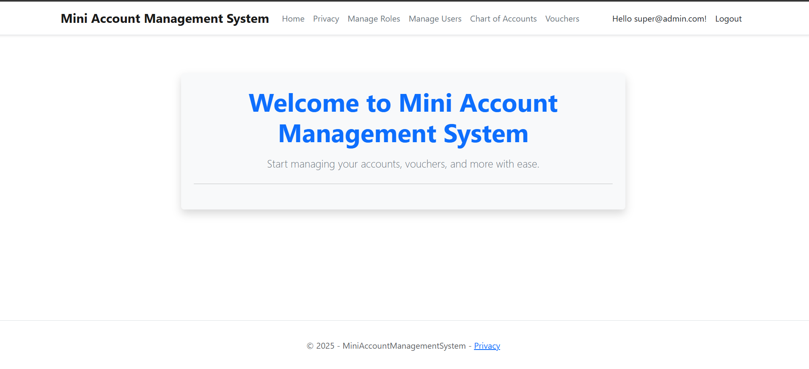
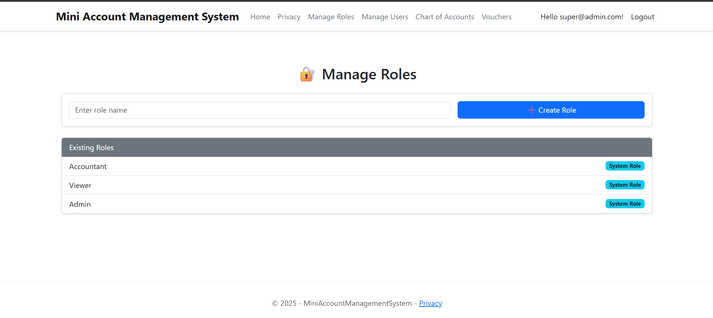
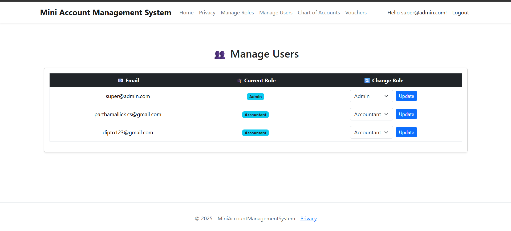
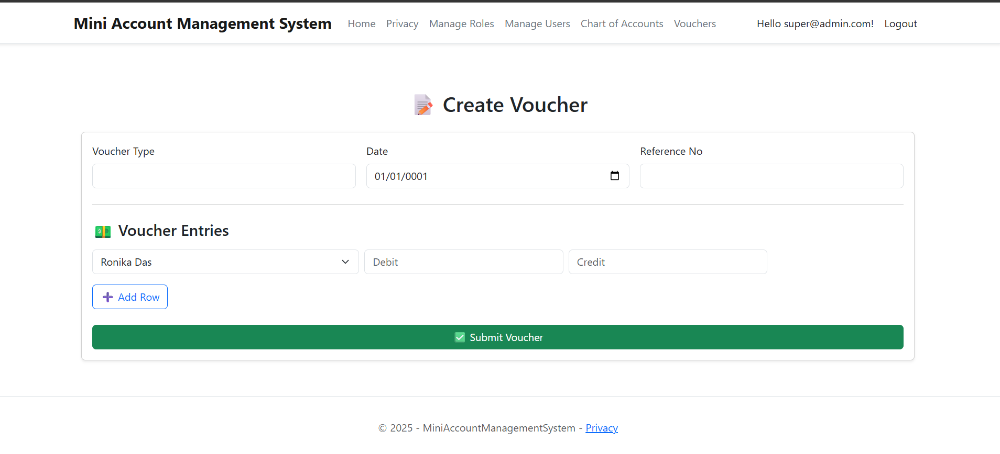
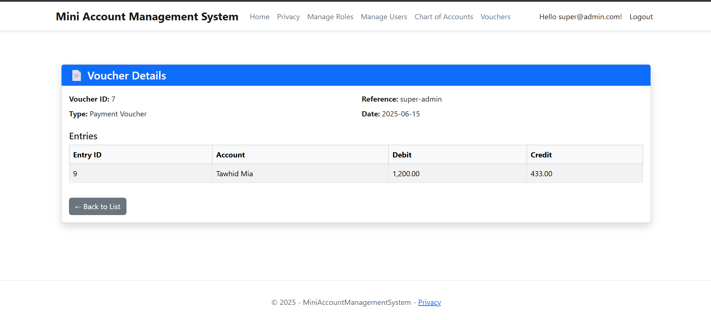
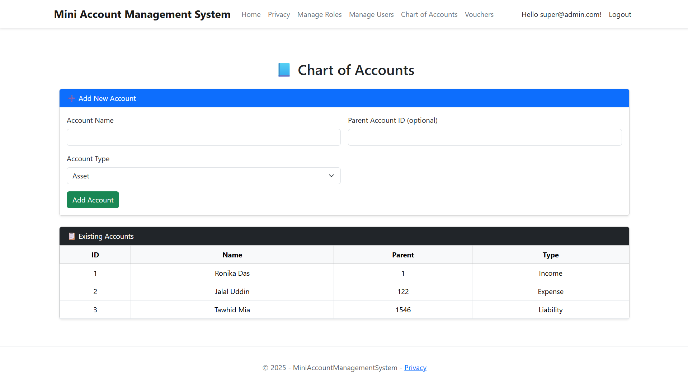

# Mini Account Management System

A modular web-based accounting system built with **ASP.NET Core Razor Pages** and **SQL Server (Stored Procedures only)**. This system supports secure authentication, role-based authorization, and financial operations such as Chart of Accounts and Voucher management.

---

## 🚀 Features

- ✔️ User registration & login with ASP.NET Identity
- ✔️ Role-based access control (Admin/User)
- ✔️ Chart of Accounts management (Add/Edit/Delete)
- ✔️ Voucher entry with multiple debit/credit lines
- ✔️ Stored procedures used for all data operations
- ✔️ Razor Pages-based UI with Bootstrap styling

---

## 📸 Screenshots

> Add these images to a `/screenshots/` folder in your repository.

### 🏠 Home Page  

### 🛡️ Manage Roles  

### 👥 Manage Users  

### 📥 Create Voucher  

### 📄 Voucher Details  

### 📘 Chart of Accounts  

---

## 🧱 Technologies Used

- **ASP.NET Core Razor Pages**
- **SQL Server (Stored Procedures)**
- **Entity Framework Core (for Identity only)**
- **Bootstrap 5**
- **Visual Studio 2022**

---

## ⚙️ Setup Instructions

### 🛠 Prerequisites

- .NET 7 SDK
- SQL Server 2019+
- Visual Studio 2022+

### 📦 Database Setup

- Create a database named `MiniAccountsDB`.
- Run the stored procedures from the `/SQLScripts/` folder.
- Update the `appsettings.json` with your SQL Server connection string:

